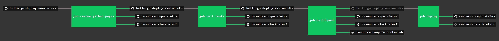

# hello-go-deploy-amazon-eks

```text
*** THE DEPLOY IS UNDER CONSTRUCTION - CHECK BACK SOON ***
```

[](https://goreportcard.com/report/github.com/JeffDeCola/hello-go-deploy-amazon-eks)
[](https://godoc.org/github.com/JeffDeCola/hello-go-deploy-amazon-eks)
[](https://codeclimate.com/github/JeffDeCola/hello-go-deploy-amazon-eks/maintainability)
[](https://codeclimate.com/github/JeffDeCola/hello-go-deploy-amazon-eks/issues)
[](http://jeffdecola.mit-license.org)

`hello-go-deploy-amazon-eks` _will test, build, push (to DockerHub)
and deploy a long running "hello-world" Docker Image to
Amazon Elastic Container Service for Kubernetes (eks)._

I also have other repos showing different deployments,

* PaaS
  * [hello-go-deploy-aws-elastic-beanstalk](https://github.com/JeffDeCola/hello-go-deploy-aws-elastic-beanstalk)
  * [hello-go-deploy-azure-app-service](https://github.com/JeffDeCola/hello-go-deploy-azure-app-service)
  * [hello-go-deploy-gae](https://github.com/JeffDeCola/hello-go-deploy-gae)
  * [hello-go-deploy-marathon](https://github.com/JeffDeCola/hello-go-deploy-marathon)
* CaaS
  * [hello-go-deploy-amazon-ecs](https://github.com/JeffDeCola/hello-go-deploy-amazon-ecs)
  * [hello-go-deploy-amazon-eks](https://github.com/JeffDeCola/hello-go-deploy-amazon-eks)
  * [hello-go-deploy-aks](https://github.com/JeffDeCola/hello-go-deploy-aks)
  * [hello-go-deploy-gke](https://github.com/JeffDeCola/hello-go-deploy-gke)
* IaaS
  * [hello-go-deploy-amazon-eks](https://github.com/JeffDeCola/hello-go-deploy-amazon-eks)
  * [hello-go-deploy-azure-vm](https://github.com/JeffDeCola/hello-go-deploy-azure-vm)
  * [hello-go-deploy-gce](https://github.com/JeffDeCola/hello-go-deploy-gce)

The `hello-go-deploy-amazon-eks`
[Docker Image](https://hub.docker.com/r/jeffdecola/hello-go-deploy-amazon-eks)
on DockerHub.

The `hello-go-deploy-amazon-eks`
[GitHub Webpage](https://jeffdecola.github.io/hello-go-deploy-amazon-eks/).

## PREREQUISITES

For this exercise I used go.  Feel free to use a language of your choice,

* [go](https://github.com/JeffDeCola/my-cheat-sheets/tree/master/software/development/languages/go-cheat-sheet)

To build a docker image you will need docker on your machine,

* [docker](https://github.com/JeffDeCola/my-cheat-sheets/tree/master/software/operations-tools/orchestration/builds-deployment-containers/docker-cheat-sheet)

To push a docker image you will need,

* [DockerHub account](https://hub.docker.com/)

To deploy to `amazon eks` you will need,

* [amazon elastic container service for kubernetes (eks)](https://github.com/JeffDeCola/my-cheat-sheets/tree/master/software/service-architectures/containers-as-a-service/amazon-elastic-container-service-for-kubernetes-cheat-sheet)

As a bonus, you can use Concourse CI to run the scripts,

* [concourse](https://github.com/JeffDeCola/my-cheat-sheets/tree/master/software/operations-tools/continuous-integration-continuous-deployment/concourse-cheat-sheet)
  (Optional)

## EXAMPLES

This repo may have a few examples. We will deploy example 1.

### EXAMPLE 1

To run from the command line,

```bash
go run main.go
```

Every 2 seconds `hello-go-deploy-amazon-eks` will print:

```bash
Hello everyone, count is: 1
Hello everyone, count is: 2
Hello everyone, count is: 3
etc...
```

## STEP 1 - TEST

Lets unit test the code,

```bash
go test -cover ./... | tee /test/test_coverage.txt
```

There is a `unit-tests.sh` script to run the unit tests.
There is also a script in the /ci folder to run the unit tests
in concourse.

## STEP 2 - BUILD (DOCKER IMAGE VIA DOCKERFILE)

We will be using a multi-stage build using a Dockerfile.
The end result will be a very small docker image around 13MB.

```bash
docker build -f build-push/Dockerfile -t jeffdecola/hello-go-deploy-amazon-eks .
```

Obviously, replace `jeffdecola` with your DockerHub username.

In stage 1, rather than copy a binary into a docker image (because
that can cause issue), the Dockerfile will build the binary in the
docker image.

If you open the DockerFile you can see it will get the dependencies and
build the binary in go,

```bash
FROM golang:alpine AS builder
RUN go get -d -v
RUN go build -o /go/bin/hello-go-deploy-amazon-eks main.go
```

In stage 2, the Dockerfile will copy the binary created in
stage 1 and place into a smaller docker base image based
on `alpine`, which is around 13MB.

You can check and test your docker image,

```bash
docker run --name hello-go-deploy-amazon-eks -dit jeffdecola/hello-go-deploy-amazon-eks
docker exec -i -t hello-go-deploy-amazon-eks /bin/bash
docker logs hello-go-deploy-amazon-eks
docker images jeffdecola/hello-go-deploy-amazon-eks:latest
```

There is a `build-push.sh` script to build and push to DockerHub.
There is also a script in the /ci folder to build and push
in concourse.

## STEP 3 - PUSH (TO DOCKERHUB)

Lets push your docker image to DockerHub.

If you are not logged in, you need to login to dockerhub,

```bash
docker login
```

Once logged in you can push to DockerHub

```bash
docker push jeffdecola/hello-go-deploy-amazon-eks
```

Check you image at DockerHub. My image is located
[https://hub.docker.com/r/jeffdecola/hello-go-deploy-amazon-eks](https://hub.docker.com/r/jeffdecola/hello-go-deploy-amazon-eks).

There is a `build-push.sh` script to build and push to DockerHub.
There is also a script in the /ci folder to build and push
in concourse.

## STEP 4 - DEPLOY

tbd

## TEST, BUILT, PUSH & DEPLOY USING CONCOURSE (OPTIONAL)

For fun, I use concourse to automate the above steps.

A pipeline file [pipeline.yml](https://github.com/JeffDeCola/hello-go-deploy-amazon-eks/tree/master/ci/pipeline.yml)
shows the entire ci flow. Visually, it looks like,



The `jobs` and `tasks` are,

* `job-readme-github-pages` runs task
  [readme-github-pages.sh](https://github.com/JeffDeCola/hello-go-deploy-amazon-eks/tree/master/ci/scripts/readme-github-pages.sh).
* `job-unit-tests` runs task
  [unit-tests.sh](https://github.com/JeffDeCola/hello-go-deploy-amazon-eks/tree/master/ci/scripts/unit-tests.sh).
* `job-build-push` runs task
  [build-push.sh](https://github.com/JeffDeCola/hello-go-deploy-amazon-eks/tree/master/ci/scripts/build-push.sh).
* `job-deploy` runs task
  [deploy.sh](https://github.com/JeffDeCola/hello-go-deploy-amazon-eks/tree/master/ci/scripts/deploy.sh).

The concourse `resources type` are,

* `hello-go-deploy-amazon-eks` uses a resource type
  [docker-image](https://hub.docker.com/r/concourse/git-resource/)
  to PULL a repo from github.
* `resource-dump-to-dockerhub` uses a resource type
  [docker-image](https://hub.docker.com/r/concourse/docker-image-resource/)
  to PUSH a docker image to dockerhub.
* `resource-marathon` users a resource type
  [docker-image](https://hub.docker.com/r/ckaznocha/marathon-resource)
  to DEPLOY the newly created docker image to marathon.
* `resource-slack-alert` uses a resource type
  [docker image](https://hub.docker.com/r/cfcommunity/slack-notification-resource)
  that will notify slack on your progress.
* `resource-repo-status` uses a resource type
  [docker image](https://hub.docker.com/r/dpb587/github-status-resource)
  that will update your git status for that particular commit.

For more information on using concourse for continuous integration,
refer to my cheat sheet on [concourse](https://github.com/JeffDeCola/my-cheat-sheets/tree/master/software/operations-tools/continuous-integration-continuous-deployment/concourse-cheat-sheet).
